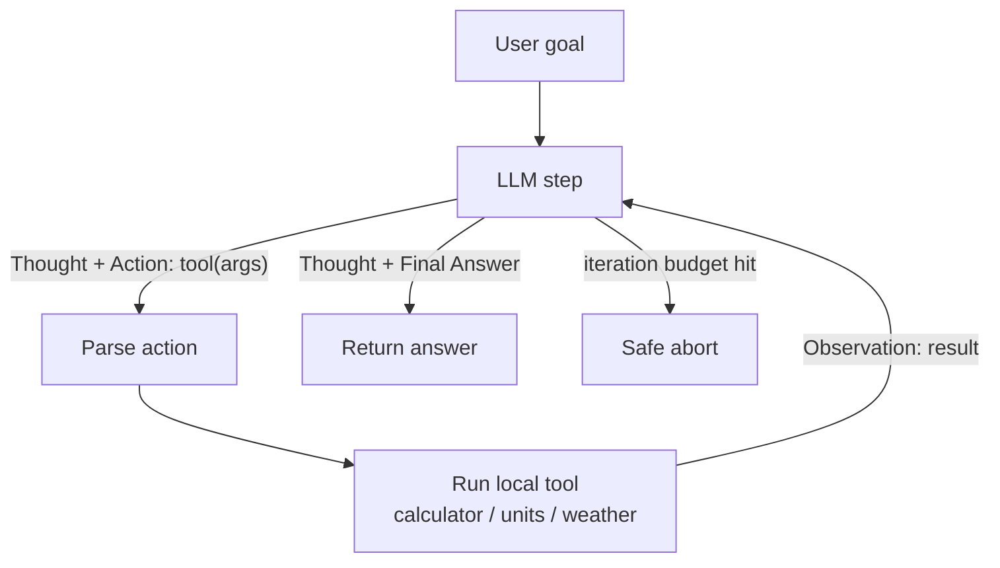
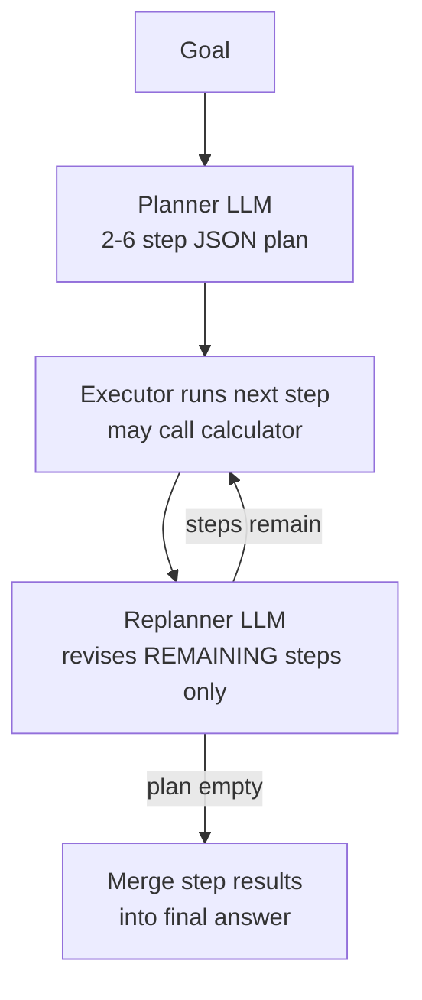

# nim-agent-lab

**12 production-grade AI agent patterns in pure Python — ReAct, planner-executor, reflection, routing, memory, guardrails and more — running on free NVIDIA NIM APIs.**


## Why

Most agent tutorials hide the actual pattern behind a framework: you learn LangChain's abstractions, not why a replanner beats a static plan or why a critique needs a rubric to produce usable edits. This repo inverts that. Each of the 12 patterns is one self-contained Python file with zero framework dependencies — just the OpenAI SDK pointed at NVIDIA's free NIM endpoint. You can read any file top to bottom in ten minutes, run it, break it, and port the mechanics to whatever stack you actually ship with. The parts frameworks gloss over are all here explicitly: max-iteration budgets, parse-failure fallbacks, fail-closed moderation, validation-repair loops, and audit logging.

## The 12 patterns

| Pattern | When to use it | Key file |
|---|---|---|
| `react` | Multi-step tasks needing tools, when the model lacks native function calling | `src/patterns/react_agent.py` |
| `tool-calling` | Same, but with native function calling — more robust, supports parallel calls | `src/patterns/tool_calling_agent.py` |
| `planner-executor` | Long tasks where the plan should adapt as results come in | `src/patterns/planner_executor.py` |
| `reflection` | Quality-sensitive writing; a rubric-scored critique pass buys real improvement | `src/patterns/reflection_agent.py` |
| `debate` | Contested questions; forcing both sides surfaces caveats a single pass misses | `src/patterns/debate_agents.py` |
| `router` | Mixed traffic; per-route prompts *and* temperatures beat one generalist prompt | `src/patterns/router_agent.py` |
| `memory` | Assistants that must remember users across turns and across restarts | `src/patterns/memory_agent.py` |
| `guardrails` | Anything user-facing; injection screens in, PII scrub + schema out | `src/patterns/guardrails_agent.py` |
| `code-interpreter` | Tasks verifiable by running code; iterate until the tests pass | `src/patterns/code_interpreter_agent.py` |
| `structured-output` | Extraction into typed objects; Pydantic validation with repair rounds | `src/patterns/structured_output_agent.py` |
| `human-in-the-loop` | Consequential actions; approve/edit/reject each step, audit-logged to disk | `src/patterns/human_in_the_loop.py` |
| `orchestrator` | Composite goals; a supervisor delegates to the other patterns as workers | `src/patterns/orchestrator.py` |

## How the core loops work

The ReAct loop — the model never sees its own hallucinated observations because generation stops at `Observation:` and the runtime supplies the real one:



Planner-executor with replanning — the piece that makes it robust is the loop back through the replanner after *every* step:



## Quickstart

```bash
git clone https://github.com/AleBrito124356/nim-agent-lab.git
cd nim-agent-lab
pip install -r requirements.txt
cp .env.example .env   # then paste your key into .env
```

Get the free API key (about two minutes):

1. Go to [build.nvidia.com](https://build.nvidia.com) and sign up — free, includes credits.
2. Open any model card and click **Get API Key**.
3. Copy the key (starts with `nvapi-`) into `.env` as `NVIDIA_API_KEY`.

Default model is `meta/llama-3.3-70b-instruct`; set `NIM_MODEL` in `.env` to try any other chat model on the catalog.

## Usage

```bash
python main.py --list                 # describe all 12 patterns
python main.py react                  # run a pattern with its demo goal
python main.py debate --goal "Should we vendor our dependencies?"
python -m src.patterns.reflection_agent "Write a release note for v2.1"   # every file runs standalone
```

What a run looks like (trimmed):

```text
$ python main.py react
[react] goal: Convert 42 kilometers to miles, square the result, ...
------------------------------------------------------------------------
[step 1]
Thought: I need to convert 42 km to miles first.
Action: convert_units(42, km, mi)
Observation: 26.0976 mi

[step 2]
Thought: Now I square that value.
Action: calculator(26.0976 ** 2)
Observation: 681.084...

[step 3]
Thought: I have everything I need.
Final Answer: 42 km is about 26.1 miles; squared that is roughly 681. ...
```

The guardrails pattern prints its full filter pipeline, and demos an injection attempt getting blocked when run standalone:

```text
[input:heuristic] BLOCKED (matched: ignore\s+(all\s+)?...(instructions|prompts|rules))
```

Runtime artifacts land in the repo root and are gitignored: `memory_store.json` (long-term facts — run the memory demo twice, it remembers), `audit_log.jsonl` and `hitl_workspace/` (human-in-the-loop decisions and notes).

## Project structure

```text
nim-agent-lab/
├── main.py                        # CLI: run any pattern by name
├── requirements.txt               # openai, python-dotenv, pydantic
├── .env.example
└── src/
    ├── nim.py                     # shared NIM client factory (key, base URL, model)
    └── patterns/
        ├── react_agent.py
        ├── tool_calling_agent.py
        ├── planner_executor.py
        ├── reflection_agent.py
        ├── debate_agents.py
        ├── router_agent.py
        ├── memory_agent.py
        ├── guardrails_agent.py
        ├── code_interpreter_agent.py
        ├── structured_output_agent.py
        ├── human_in_the_loop.py
        └── orchestrator.py        # supervisor that uses the others as workers
```

## Notes on scope

- **Self-containment over DRY.** The safe AST calculator appears in four files on purpose: each pattern file must be readable and runnable alone. That is a teaching-repo trade-off, stated openly.
- **Mock tools are deterministic.** Weather and FX rates come from fixed tables so runs are reproducible; each is one function swap away from a real API.
- **The code interpreter is not a sandbox.** Generated code runs in a subprocess with `-I` and a timeout — failure isolation, not a security boundary. The file's docstring spells out what to use for untrusted inputs.

## Related projects

More free-NIM repos from the same author:

- [rag-blueprints](https://github.com/AleBrito124356/rag-blueprints) — 8 RAG architectures from naive to agentic, each runnable standalone.
- [langgraph-agent-flows](https://github.com/AleBrito124356/langgraph-agent-flows) — the same agent ideas expressed as LangGraph topologies, when you do want a framework.
- [llm-eval-toolkit](https://github.com/AleBrito124356/llm-eval-toolkit) — prompt regression testing and LLM-as-judge evaluation for agents like these.
- [nim-free-api-quickstarts](https://github.com/AleBrito124356/nim-free-api-quickstarts) — minimal copy-paste quickstarts for every free NIM capability.

## License

MIT — see [LICENSE](LICENSE). Copyright (c) 2026 Alejandro Brito.
